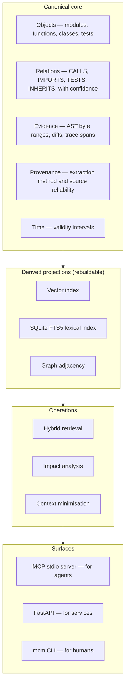

# Mathematical Context Model (MCM)

### [Open the Live Application →](https://abusuraihsakhri.github.io/mcm/)

A research prototype for semantic code memory, retrieval, dependency analysis, and pre-action change-impact analysis.

**Dr. Abu Suraih Sakhri** — `abusuraihsakhri@gmail.com` · [`@abusuraihsakhri`](https://github.com/abusuraihsakhri)

[](https://github.com/abusuraihsakhri/mcm)
[](https://doi.org/10.5281/zenodo.22923463)
[](https://www.python.org/downloads/)
[](https://github.com/abusuraihsakhri/mcm/actions/workflows/tests.yml)
[](docs/agent-integration.md)
[](https://abusuraihsakhri.github.io/mcm/)
[](LICENSE)

> **Audit (24 September 2026):** [Implementation and methodology findings](docs/audit-2026-09-24.md) identify unresolved semantic-equivalence, temporal-history and benchmark-validity limitations.
>
> **Status: research prototype.** This is an implementation of a specification,
> with a benchmark attached that tries to falsify its central claim. The results
> are mixed and are reported that way. Read
> [docs/evaluation.md](docs/evaluation.md) before citing any number here.

---

## The problem

A coding agent that relies only on text retrieval has limited explicit support
for a question that matters before an edit: *if I change this function, what
breaks?*

Fixed-size chunks can split structural relationships across windows, while
similarity ranking can miss dependencies whose wording differs from the query.
MCM adds a typed relation graph and evidence-carrying traversal so those
relationships can be queried directly rather than inferred from text similarity
alone.

## What it does

The codebase becomes a store of five things: objects, relations between them,
evidence for each relation, provenance for each piece of evidence, and the time
interval over which each fact held.

$$K = \langle \mathcal{O}, \mathcal{R}, \mathcal{E}, \mathcal{P}, \mathcal{T} \rangle$$

Objects get identifiers derived from their position in the syntax tree rather
than their position in the file, so `repo://auth.py#function:validate_token`
survives everything above it moving. Relations carry a confidence. Composing
relations along a path multiplies those confidences and applies a per-edge decay,
so a claim two hops away arrives weaker than a claim one hop away, which is what
you want when deciding how much to trust it.

Everything else — the vector index, the lexical index, the graph adjacency — is
derived, and can be deleted and rebuilt without losing knowledge.

Three operations sit on top:

**Retrieval** ranks definitions against a description using graph structure,
vector similarity, lexical match, symbolic resolution and provenance together,
rather than any one of them.

**Impact analysis** takes a proposed change and walks the extracted dependency
graph to report what it reaches and which tests are linked to those definitions,
before the edit is written.

**Context minimisation** assembles the smallest set of facts that still supports
a task, and checks three conditions on the result: that traversing the reduced
set reproduces the same closure and confidences as the full store, that every
object it mentions is present in it, and that every relation still points at
source evidence.

## Quickstart

```bash
git clone https://github.com/abusuraihsakhri/mcm.git
cd mcm
python -m venv .venv
.venv/Scripts/activate          # Windows
# source .venv/bin/activate     # macOS / Linux
pip install -e ".[dev,api]"
```

Index a repository, then ask it something:

```bash
mcm ingest /path/to/repo --db mcm.db
mcm index --db mcm.db
mcm search "where are tokens validated" --db mcm.db
mcm propagate validate_token --kind SIGNATURE --db mcm.db
```

Ingestion runs at roughly 66 files per second. Django's 2,932 Python files index
in 44 seconds on a laptop.

## Using it from a coding agent

MCM ships an MCP server over stdio, which is what Claude Code, Cursor, Codex,
OpenCode and Antigravity use to reach external tools. It has no dependencies
beyond the package itself.

```json
{
  "mcpServers": {
    "mcm": {
      "type": "stdio",
      "command": "/absolute/path/to/.venv/bin/mcm-mcp",
      "args": ["--db", "/absolute/path/to/mcm.db"]
    }
  }
}
```

That snippet is Claude Code's `.mcp.json`. Cursor, Codex, OpenCode and
Antigravity each want it in a different file and a different shape — Codex uses
TOML, OpenCode puts the whole command in one array — and
[docs/agent-integration.md](docs/agent-integration.md) has the exact
configuration for each, along with the five tools and what goes wrong.

## How it compares

The row that matters is the last one, and it is the reason to read the
evaluation rather than this table.

| | Chunk vector RAG | Graph memory | Full-context dump | MCM |
| :--- | :--- | :--- | :--- | :--- |
| Unit of knowledge | Line windows | AST nodes | Whole files | Typed objects and relations |
| Symbol identity | File and line offset | Node label | File path | Qualname, line-independent |
| Answers "what breaks?" | No | Partially, by traversal | No | Yes, with typed changes and per-hop confidence |
| Learns from execution | No | No | No | Yes, via trace and test observation |
| Knows when a fact expired | No | No | No | Yes, validity intervals |
| **Measured advantage** | — | — | — | **Retrieval, yes. Efficiency, only against graph memory once baselines are tuned equally.** |

The first five rows are architectural and follow from the design. The last is
empirical and is weaker than the others. Both belong in the same table.

## What the evaluation found

Two repositories are scored — `itsdangerous` (34 tasks) and `flask` (149 tasks) —
and a third, `httpx` (237 tasks), is used only for fitting hyperparameters and is
never scored. That separation is what keeps every number below held-out. Ground
truth comes from git history: each system indexes a repository at a horizon
commit and is asked about commits after it, so the answer is what the commit
actually changed and nobody chose it.

Every system is tuned, not just MCM. This matters more than any single figure.
The untuned run makes MCM look considerably better than it is.

Held-out scores, all systems tuned on `httpx`:

| Repository | System | Recall@10 | Precision@10 | MRR | Context efficiency |
| :--- | :--- | ---: | ---: | ---: | ---: |
| itsdangerous | Vector RAG | 0.320 | 0.157 | 0.388 | 0.200 |
| itsdangerous | Graph memory | 0.238 | 0.139 | 0.288 | 0.165 |
| itsdangerous | Hybrid RRF | 0.395 | 0.178 | 0.454 | 0.176 |
| itsdangerous | **MCM** | **0.408** | **0.228** | **0.512** | **0.246** |
| flask | Vector RAG | 0.279 | 0.085 | 0.250 | 0.071 |
| flask | Graph memory | 0.195 | 0.078 | 0.176 | 0.035 |
| flask | Hybrid RRF | 0.311 | 0.095 | 0.277 | 0.050 |
| flask | **MCM** | **0.341** | **0.110** | **0.315** | 0.069 |

MCM leads on recall, precision and MRR on both repositories. On context
efficiency, after tuning, its advantage over vector RAG is no longer separable
from zero. What survives is an advantage over graph memory, and over the hybrid
on flask.

The specification's hypothesis was `MCM > Graph > Vector RAG`. The first link
holds. **The second fails** — graph memory is the weakest of the three baselines
here, not the second best. That is a negative result about the specification,
produced by a benchmark built to be able to produce one.

### Django, and a result that nearly went the other way

A third repository was added once ingestion became fast enough to run it:
`django/django`, 2,932 Python files, 426 tasks. MCM beats all three baselines on
context efficiency with separated intervals — the cleanest win in the whole
evaluation:

| System | Recall@10 | Precision@10 | MRR | Context efficiency |
| :--- | ---: | ---: | ---: | ---: |
| Vector RAG | 0.285 | 0.079 | 0.253 | 0.053 |
| Graph memory | 0.135 | 0.037 | 0.140 | 0.061 |
| Hybrid RRF | 0.315 | 0.085 | 0.324 | 0.068 |
| **MCM** | **0.454** | **0.143** | **0.496** | **0.114** |

The interesting part is what happened on the way there. With the default offline
embedding provider — feature hashing, not a trained model — Django *supported*
the full hypothesis chain, including `graph > vector-rag`. Give every system a
real embedding model instead and that second link goes back to "approximately
equal", because vector RAG improves and graph memory, which embeds nothing,
does not.

So the chain holds in exactly one configuration out of five tested, and that
configuration is the one with the weakest baseline. Reporting it would have been
a flattering and wrong conclusion. `graph > vector-rag` is not supported.

One more finding worth stating plainly: MCM's fitted weights gained +0.046 on the
repository they were fitted on and nothing on either repository they were not,
while the simplest baseline improved on both. A seven-parameter search over 1404
configurations overfits where a six-point sweep cannot. Details, and eight further
limitations, are in [docs/evaluation.md](docs/evaluation.md).

## What the test suite establishes, and does not

The suite checks that the implementation matches its own specification: that
relation composition is associative, that temporal intervals close instead of
deleting, that the e-graph finds the equivalences it should, that the store round
-trips. It is a statement about internal consistency.

It is not evidence that MCM helps an agent. Nothing in the test suite touches
that question. The benchmark addresses a part of it — what gets put in front of an
agent — and what an agent then does with it is measured separately, in
[`docs/evaluation.md`](docs/evaluation.md) under "An agent in the loop". That
experiment returned a null: giving an agent impact analysis did not change which
files it edited (p = 0.28 over 23 tasks).

```bash
pytest                                    # full unit/integration suite
python scripts/test_agent_simulation.py   # end-to-end agent walkthrough
```

## Architecture

Comments in the source cite "section N" of the design specification that the
implementation was written against. That specification is not published here;
the sections it names are described, in the terms that matter to a reader of the
code, across [`docs/`](docs/).




Module map, and the documentation for each part:

| Area | Package | Document |
| :--- | :--- | :--- |
| Objects, relations, evidence | `mcm/core/` | [semantic-model.md](docs/semantic-model.md), [provenance.md](docs/provenance.md) |
| Composition and confidence | `mcm/algebra/` | [relation-algebra.md](docs/relation-algebra.md) |
| Inference and propagation | `mcm/reasoning/` | [inference.md](docs/inference.md), [change-propagation.md](docs/change-propagation.md) |
| Prediction before edits | `mcm/reasoning/` | [prediction.md](docs/prediction.md) |
| Retrieval | `mcm/retrieval/` | [retrieval.md](docs/retrieval.md) |
| Context assembly | `mcm/agent/` | [agent-loop.md](docs/agent-loop.md) |
| Equivalence | `mcm/equivalence/` | [equivalence.md](docs/equivalence.md) |
| History replay | `mcm/ingestion/` | [history.md](docs/history.md), [temporal-model.md](docs/temporal-model.md) |
| Benchmark | `mcm/benchmark/` | [evaluation.md](docs/evaluation.md) |
| Agent integration | `mcm/mcp_server.py` | [agent-integration.md](docs/agent-integration.md) |

## The theory, briefly

**Identity.** Every symbol is addressed as
`repo://relpath#type:qualname`, so edits above a definition do not change what it
is called.

**Composition.** Confidence along a path is
$c(R_1 \circ R_2) = c(R_1) \cdot c(R_2) \cdot \delta(R_1, R_2)$, where $\delta$
is a per-edge-type decay. Distance costs certainty.

**Two kinds of uncertainty, kept apart.** How strong an observation is
($s$: an AST match is 1.0, a docstring mention is not) is tracked separately from
how reliable its source is ($r$: a parser is 1.0, an LLM guess is not). Collapsing
them into one number loses the ability to say why a claim is weak.

**Time.** A fact that stops being true has its interval closed, not its row
deleted, so a query against an earlier moment still answers correctly.

**Entailment.** A minimised context $C^*$ is accepted only if traversal over it
reproduces the full store's closure and confidences, every object it references
is present in it, and every relation it contains still points at live evidence.

**Observation.** When a trace or a test run confirms an edge, confidence moves by
$C_{t+1} = (C_t \alpha + s)/(\alpha + 1)$ with prior strength $\alpha = 4.0$.

## REST API

For calling MCM from a service rather than an agent. The server is a factory, so
it needs `--factory`:

```bash
pip install -e ".[api]"
uvicorn --factory mcm.api.app:create_app --port 8000
```

Then `http://localhost:8000/docs` for the generated schema. The routes:

| Route | Method | Purpose |
| :--- | :--- | :--- |
| `/health` | GET | Liveness |
| `/repositories/ingest` | POST | Index a repository |
| `/objects` | GET | Get an object by ID/reference |
| `/objects/{id}/relations` | GET | Relations touching an object |
| `/query` | POST | Impact, dependency and other query modes |
| `/impact` | POST | What a change to one definition reaches |
| `/reason` | POST | Run the inference rules |
| `/constraints/check` | POST | Evaluate architectural constraints |
| `/contradictions` | POST | Find conflicting claims |
| `/memory` | POST | Apply a memory update |
| `/history/{id}` | GET | How an object changed over time |
| `/provenance/{id}` | GET | Where a relation came from |
| `/observations/tests` | POST | Feed a test run back into confidence |
| `/observations/trace` | POST | Feed a runtime trace back into confidence |

## Interactive portal

[`abusuraihsakhri.github.io/mcm`](https://abusuraihsakhri.github.io/mcm/) runs
six simulations in the browser with no build step: a force-directed graph you can
drag, an impact sandbox, a context minimisation budget slider, an entailment
checker, a head-to-head retrieval comparison, and the benchmark results.

The simulations are illustrative. They run on a fixed fixture, not on a live
index, and they are there to make the mechanism visible rather than to produce
evidence.

## Data handling and security

The core indexer and default hashed embedding provider run locally. Repository
content is stored in the SQLite index selected by the user. The GitHub Pages
portal is a static, fixed-fixture demonstration: it does not upload repositories
or call the MCM API, and its only browser persistence is the selected theme.

The optional agent-experiment scripts can send prompts and selected tool output
to external model providers when their API keys are supplied. Keys are read from
environment variables and are not written to the repository; quota state stores
only short key fingerprints.

The REST ingestion endpoint accepts local filesystem paths by design. Keep the
service bound to a trusted interface, or set `MCM_ALLOWED_INGEST_ROOTS` to a
semicolon-separated list of directories that the API may index.

## Limitations

Python only; the parser and every extractor are Python-specific. Static analysis
by default, so dynamic dispatch, `getattr` and registry lookups are invisible
until the runtime tracing channel is actually run. There is one horizon per
repository; the initial two-repository evaluation was followed by a broader suite.
The default embedding provider is feature hashing rather than a trained model.
The token estimator is not a BPE tokenizer, and its error need not affect different
representations equally. The agent study measured file selection; improved repair
success and regression prevention remain unestablished.

The full list is at the end of [docs/evaluation.md](docs/evaluation.md).

## Citation

```bibtex
@misc{sakhri2026mcm,
  title  = {Mathematical Context Model (MCM): Semantic Code Memory,
            Retrieval, and Pre-Action Change-Impact Analysis},
  author = {Sakhri, Abu Suraih},
  year   = {2026},
  version = {0.1.0},
  doi    = {10.5281/zenodo.22923463},
  url    = {https://doi.org/10.5281/zenodo.22923463},
  note   = {Research prototype}
}
```

## License

Copyright © 2026 Abu Suraih Sakhri. Licensed under the Apache License,
Version 2.0; see [LICENSE](LICENSE).
